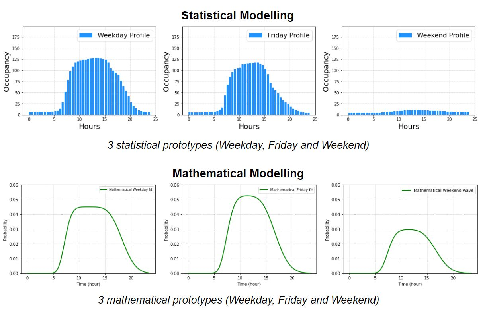
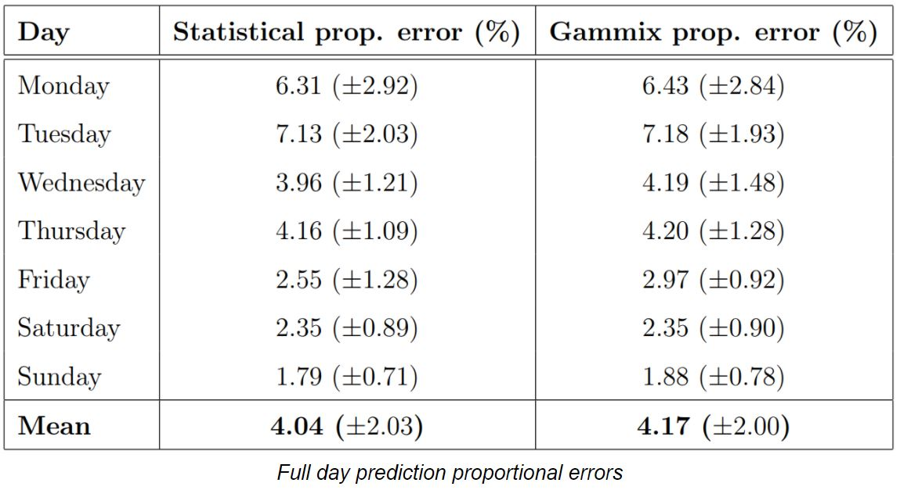
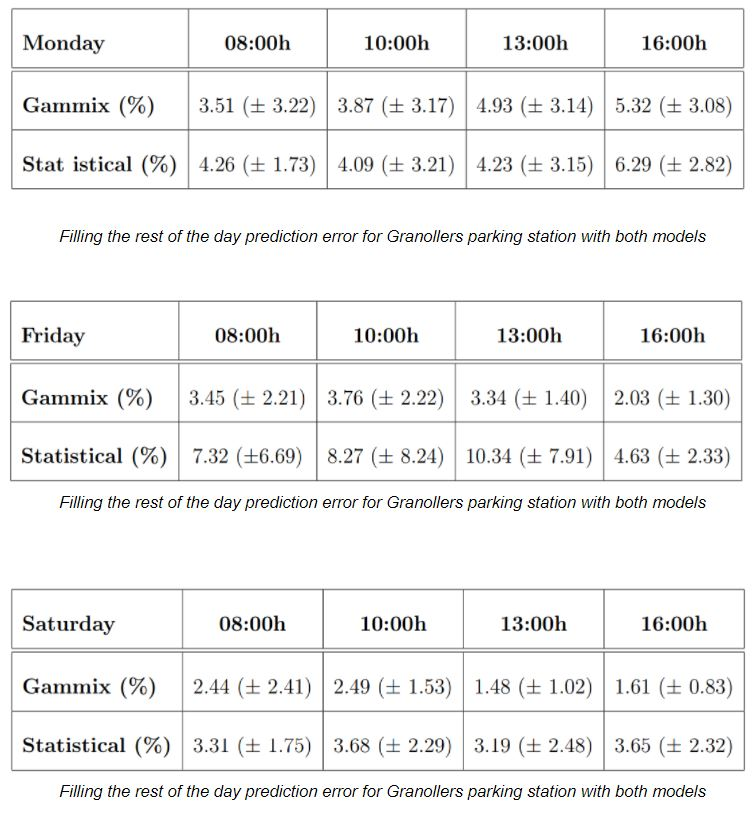

# Modelling and prediction of the use of car parks in the province of Barcelona
Master's Thesis in collaboration with Josep Ferrer, supervised by Vicenç Gomez. Data provided by ATM.  

In the context of two final master's theses, the behaviour of car park usage in the province of Barcelona has been analysed in order to make a model (first test) and a predictive system (second test) to help reduce traffic emissions. It is also interesting to understand how the weather, or common events (for example) such as the pandemic, have affected car parks. This study has been conducted over a period of time using data provided by the ATM, taking into account the number of full spaces at different prices with a resolution of 30 minutes.

The modelling of the occupancy behaviour of the stalls has been done in two different ways: a first approach using directly historical data and grouping different groups of dice with similar behaviour to obtain generic prototypes that cover their behaviour, resulting in a total of 3 prototypes: Dies entre setmana finos Dijous (included), Divendres and Caps de Setmana. Each of the prototypes requires 48 metres per side. 

On the other hand, to simplify the statistical model, a second mathematical model has been developed. In this second case, for each of the groups of matrices with similar behaviour, a mathematical tie resulting from the difference between two cumulative probability densities (CDF) has been parameterised and the difference between the resulting model and all the matrices that make up each of the groups has been minimised. In this way, three mathematical models have been obtained that only require 7 parameters and that obtain a better interpretation of the phenomenon. 

In terms of prediction, two different types have also been evaluated: the prediction of a single day in the future with a resolution of 30 minutes, and the prediction of the remaining hours of the day taking into account the previous known data of the day. Each of these approximations has been evaluated with the two modelling approaches to demonstrate which method provides better predictions, not only in terms of accuracy but also in terms of interpretation and simplicity.

Considering the prediction of single days, the results of the predictions are very satisfactory, obtaining errors proportional to the assessed parking around 10% in the best of cases, being around 5% of average proportional error the most usual result. The following tables show the results for some of the car parks analysed. 

Switching to the second prediction model, having evidence of data improves the accuracy of the prediction of the remaining hours. This is thanks to a rescaling of the prototypes used for the offline version (day-ahead prediction) taking into account the status of the car park at the last time the measurement was taken, and using the proportional difference between this value and that of the prototype as a rescaling factor.  

In terms of external factors that may influence the way in which car parks in the province of Barcelona are used, the weather has a minimal effect on occupancy due also to the nature of the car parks, which are for transferring from car to train, and are used by people who normally have the responsibility of making the journey regardless of the weather. As for the pandemic, it has been observed that the pattern of people's behaviour has not changed much, but the number of people using the car parks has changed drastically. Therefore, the change is more in the volume than in the way of occupying the parking lots.

As a conclusion of this collaborative study, it can be stated that through historical data it is relatively simple to characterise and predict the future behaviour of the use of parking lots, and that immense amounts of data are not required to have satisfactory accuracy. To affirm that the mathematical model is more accurate, more interpretable and simpler in terms of the parameters required than the statistical model. This study opens the door to future research and applications, as well as to various improvements in terms of integrability and automation of the learning process. 

